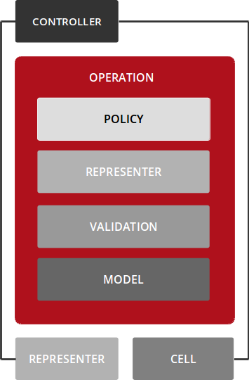
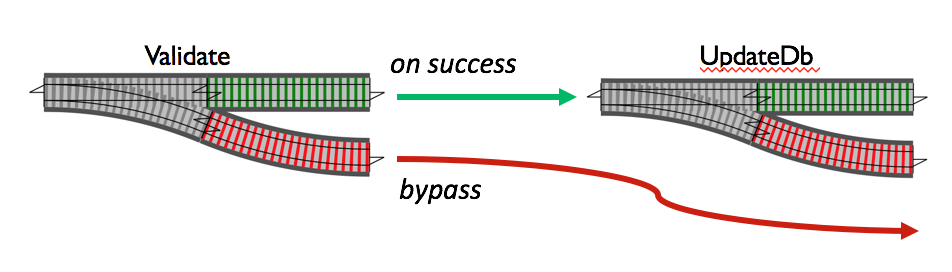
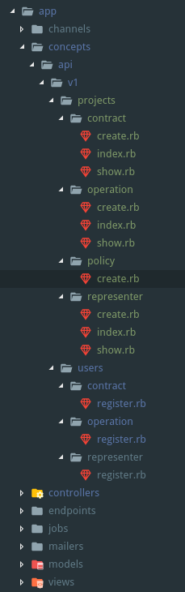
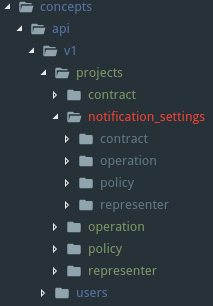
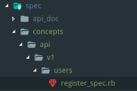

# Trailblazer 2.1

## Overview

### What is this?

It’s a business logic framework.

Trailblazer provides new high-level abstractions for Ruby frameworks. It gently enforces encapsulation, an intuitive code structure and gives you an object-oriented architecture.

Trailblazer gives you a high-level architecture for web applications. It extends the basic MVC pattern with new abstractions. Conventions that go far beyond database table naming or route paths let you focus on your application code, minimize bugs and improve the maintainability.



### What problem it solves?

Controllers end up as lean HTTP endpoints. No business logic is to be found in the controller, they instantly delegate to their respective operation.
By standardizing the business logic, new developers can be onboarded faster with help of our free documentation. Trailblazer’s patterns cover 75% of daily business code’s structure - you will feel the power of strong conventions within the first hours.

### Why do we need it?

Trailblazer defines patterns for a better architecture, and gives you implementations to use those patterns in your applications. Your software will be better structured, more consistent and with stronger, faster, and way simpler tests.

### Railway oriented programming

Trailblazer uses railway oriented programming pattern. And in 2.1 release it’s possible to use more than two tracks (fail/success)

Railway oriented programming is a design pattern which helps us handle errors in our applications. Instead of relying on exceptions, we design our data and functions in a specific way.



## Code Structure

### Where to put business logic

Trailblazer’s file structure organizes by CONCEPT, and then by technology.
It embraces the COMPONENT STRUCTURE of your code.
The modular structure SIMPLIFIES REFACTORING in hundreds of legacy production apps.
To avoid constants naming collision with your active_record models it’s better to name your concepts using plurals nouns.

Code structure example:



### Operation is a service object implementation with functional flow control.

The goal of an operation is to encapsulate all business logic of one feature in an application. Since features (or functions) in web applications are often, very often, mapped to controller actions, sometimes operations are compared to controller actions, orchestrating all logic related to business except for HTTP-related code.

In particular, this means that neither HTTP code nor rendering is part of an operation.

### Contract is a form object to validate incoming data.

A contract is an abstraction to handle validation of arbitrary data or object state. It is a fully self-contained object that is orchestrated by the operation. The actual validation can be implemented using Reform with ActiveModel::Validation or dry-validation, or a Dry::Schema directly without Reform. The Contract macros helps you defining contracts and assists with instantiating and validating data with those contracts at runtime.

### Representer is used to serialize objects.

Representers help to parse and render documents for JSON or XML APIs. After defining a representer, it can either parse an incoming document into an object graph, or, the other way round, serialize a nested object into a document.

### Policy to authorize code execution per user.

Policy objects to handle authorization.

### Nested concepts

It’s ok to use nested concepts when your business logic belongs to specific scope. For example you have a project that has notification settings. You can place your notification_settings concept under projects.



### Tests structure

In Trailblazer, you write operation integration tests. Operations encapsulate all business logic and are single-entry points to operate your application. There’s no needs to test contract/representer etc in isolation. You need to test your operation with all dependencies.



## Ruby on Rails API app integration

Step by step tutorial of creating rails application using trailblazer stack

Let's create new rails application using:

```bash
rails new api-app -T --database=postgresql --api
```

### 1. Trailblazer bundle

`Gemfile`

```ruby
# Trailblazer bundle
gem 'trailblazer-endpoint', github: 'trailblazer/trailblazer-endpoint'
gem 'trailblazer-rails'
```

#### 1.1. trailblazer-endpoint

`trailblazer-endpoint` is generic HTTP handlers for operation results.

Trailblazer brings a lot of clarity to your controller logic, pushing you to create operations that have a clear workflow. Each operation returns a result object with enough information in it to evaluate what to do. The problem now lies on the code duplication that one is forced to write to evaluate a set of possible cases, generally solved the same way for each controller.

E.g. an unauthenticated request should always be resolved in the same way (exclude special cases)

From this idea, Endpoint gem came to life. Wrapping some of the most common cases with a common solution for them. This allows you to don't have to worry with the returning values of each of your operations.

Naturally, not everyone has common cases and, in the light of Trailblazer flexibility, you can override all the behavior at any level of the app.

#### 1.2. trailblazer-rails

This will automatically pull `trailblazer` and `trailblazer-loader`.

### 2. Rspec

The Rspec team officially states controller specs are now [discouraged](http://rspec.info/blog/2016/07/rspec-3-5-has-been-released/). So we will implement request specs using `json_matchers` to match serialized responses.

`Gemfile`

```ruby
group :development, :test do
  gem 'rspec-rails'
end

group :test do
  gem 'json_matchers'
end
```

### 3. Devise

Next add devise gem to generate user model which we will use for authentication:

`Gemfile`

```ruby
# Authentication
gem 'devise'
```

Run devise installer to generate default config:

```bash
rails generate devise:install
```

#### 3.1. User model

Create user model using devise generator:

```bash
rails generate devise user
```

Run migrations to create users table in the database:

```bash
rails db:migrate
```

#### 4. Jsonapi-rb

We will use `jsonapi-rb` gem for serializing documents using jsonapi 1.0 specification.

`Gemfile`

```ruby
gem 'jsonapi-rails', github: 'jsonapi-rb/jsonapi-rails'
```

#### 5. Api Documentation

Dox generates API documentation from Rspec controller/request specs in a Rails application.

`Gemfile`

```ruby
group :test do
  gem 'dox', require: false
end
```

#### 5. Create first request test.

Start with user registration endpoint

`spec/requests/api/v1/user/registration_spec.rb`

```ruby
# frozen_string_literal: true

RSpec.describe 'Api::V1::User::Registration', type: :request do
  include ApiDoc::V1::User::Registration::Api

  describe 'POST #create' do
    include ApiDoc::V1::User::Registration::Create

    describe 'Success' do
      let(:valid_params) do
        {
          email: FFaker::Internet.email,
          password: '!1password',
          password_confirmation: '!1password'
        }.to_json
      end

      before { post '/api/v1/user/registration', params: valid_params, headers: json_api_headers }

      it 'renders created user', :dox do
        expect(response).to be_created
        expect(response).to match_json_schema('user/registration')
      end
    end
  end
end
```

Now we have to make our spec pass.

Start with routes.

`config/routes.rb`

```ruby
Rails.application.routes.draw do
  # devise_for :users
  # For details on the DSL available within this file, see http://guides.rubyonrails.org/routing.html
  namespace :api do
    namespace :v1 do
      namespace :user do
        resource :registration, only: :create
      end
    end
  end
end
```

We can now generate expected json schema for our request spec.

You can find JsonApi Schema definition following this link [JSON API schema example](https://jsonapi.org/faq/#is-there-a-json-schema-describing-json-api)

Also you can use service like https://www.jsonschema.net/ to generate required json schemas.

`spec/support/api/schemas/user/registration.json`

```json
{
  "definitions": {},
  "$schema": "http://json-schema.org/draft-07/schema#",
  "$id": "file:/user/resgistration.json#",
  "type": "object",
  "title": "User Registration Schema",
  "required": [
    "data"
  ],
  "properties": {
    "data": {
      "$id": "#/properties/data",
      "type": "object",
      "title": "The Data Schema",
      "required": [
        "id",
        "type",
        "attributes"
      ],
      "properties": {
        "id": {
          "$id": "#/properties/data/properties/id",
          "type": "string",
          "title": "The Id Schema",
          "default": "",
          "examples": [
            "14"
          ],
          "pattern": "^(.*)$"
        },
        "type": {
          "$id": "#/properties/data/properties/type",
          "type": "string",
          "title": "The Type Schema",
          "default": "",
          "examples": [
            "users"
          ],
          "pattern": "^(.*)$"
        },
        "attributes": {
          "$id": "#/properties/data/properties/attributes",
          "type": "object",
          "title": "The Attributes Schema",
          "required": [
            "email"
          ],
          "properties": {
            "email": {
              "$id": "#/properties/data/properties/attributes/properties/email",
              "type": "string",
              "title": "The Email Schema",
              "default": "",
              "examples": [
                "email@email.em"
              ],
              "pattern": "^(.*)$"
            }
          },
          "additionalProperties": false
        }
      }
    }
  }
}
```

Create default endpoint using `trailblazer-endpoint` with `dry-matcher`

`app/endpoints/api/endpoint.rb`

```ruby
# frozen_string_literal: true

module Api
  class Endpoint < Trailblazer::Endpoint
    Matcher = Dry::Matcher.new(
      created: Dry::Matcher::Case.new(
        match:   ->(result) { result.success? && result['model.action'] == :new },
        resolve: ->(result) { result }
      ),
      invalid: Dry::Matcher::Case.new(
        match:   ->(result) { result.failure? && result['result.contract.default'] && result['result.contract.default'].failure? },
        resolve: ->(result) { result }
      )
    )

    def matcher
      Api::Endpoint::Matcher
    end
  end
end
```

This matcher will be used in the application controller to catch all regular operation results.

`app/controllers/api_controller.rb`

```ruby
# frozen_string_literal: true

class ApiController < ApplicationController
  include DefaultEndpoints
  include JsonapiParsing
  include JsonapiPointers
  include JsonapiContentTypeRestriction
end
```

`app/controllers/concerns/default_endpoints.rb`

```ruby
# frozen_string_literal: true

module DefaultEndpoints
  protected

  def default_handler
    lambda do |m|
      m.created do |result|
        render jsonapi: result[:model], **result[:renderer_options], status: :created
      end
      m.invalid do |result|
        render jsonapi_errors: result['contract.default'].errors,
                        class: {
                          'Reform::Form::ActiveModel::Errors': JSONAPI::Rails::SerializableActiveModelErrors
                          },
                        status: :unprocessable_entity
      end
    end
  end

  def endpoint(operation_class, _options = {}, &block)
    Api::Endpoint.call(operation_class, default_handler, { params: params.to_unsafe_h }, &block)
  end
end
```

Now we can use `endpoint` method in all our actions.

`controllers/api/v1/user/registrations_controller.rb`

```ruby
module Api
  module V1
    module User
      class RegistrationsController < ApiController
        def create
          endpoint Api::V1::Users::Operation::Register
        end
      end
    end
  end
end
```

Now request test will fail because we didn't implement operation for endpoint method.

Implement user register operation

`app/concepts/api/users/operaion/register.rb`

```ruby
# frozen_string_literal: true

module Api::V1::Users::Operation
  class Register < Trailblazer::Operation
    step Model(User, :new)
    step Contract::Build(constant: Api::V1::Users::Contract::Register)
    step Contract::Validate()
    step Contract::Persist()
    step :renderer_options

    def renderer_options(ctx, **)
      ctx[:renderer_options] = {
        class: {
          User: Api::V1::Users::Representer::Register
        }
      }
    end
  end
end
```

Implement user register contract using activemodel validations

`app/concepts/api/users/contract/register.rb`

```ruby
# frozen_string_literal: true

module Api::V1::Users::Contract
  class Register < Reform::Form
    property :email
    property :password
    property :password_confirmation

    validates :email, presence: true
    validates :password, presence: true, length: { minimum: 6 }

    validate :password_ok?

    def password_ok?
      errors.add(:password, I18n.t('errors.password_missmatch')) if password != password_confirmation
    end
  end
end
```

Implement user register representer.

`app/concepts/api/users/representer/register.rb`

```ruby
# frozen_string_literal: true

module Api::V1::Users::Representer
  class Register < JSONAPI::Serializable::Resource
    type 'users'

    attributes :email
  end
end
```

[More complex feature implementation tutorial using trailblazer 2.0.7](https://github.com/leksster/rails-trailblazer-json-api-example/wiki/Feature-tutorial)

### What gems are needed
### Loader
### Pundit integration
### Jsonapi-rb integration
### Tips and Tricks
- How to stub operation
- How to transform request params
- Manual validation
- Work with ActiveRecord transactions
- Nested operations
- Callable steps
- Composition over inheritance
- How to use decorator for represented resources

### Implement simple feature using trailblazer stack (TDD style)
- Request spec
- Controller logic
- Operation spec
- Operation logic
- Contract logic
- Representer logic

1. Внедрить в существующий проект. Что это даст, бонусы, для чего? В каких случаях хуже/лучше.
2. Пример внедрения. Легаси.
3. Форм обджект сложная. С несколькими сущностями.
4. JSONapi specification.
5. Reform populator, prepopulator, default.
6. User & UserProfile & UserAddress
